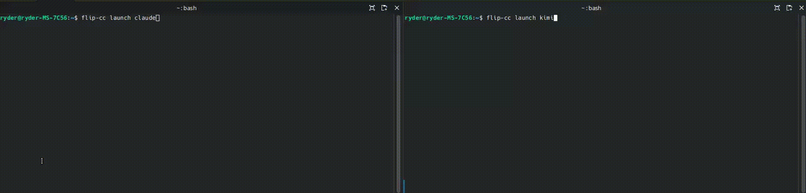

# flip-cc

**flip-cc** is a lightweight CLI launcher for Claude Code that lets you run multiple AI providers simultaneously. Anthropic, Moonshot Kimi, Minimax, OpenRouter, and custom OpenAI-compatible endpoints—through named profiles. API keys are injected per-session; your global environment is never touched.

---

## Split Screen: Multiple Providers at Once

The main use case — open side-by-side terminals and launch different providers simultaneously with zero key conflicts:



---

## Install & Upgrade

**Install:**

```bash
curl -fsSL https://raw.githubusercontent.com/RyderAsKing/flip-cc/main/install.sh | bash
```


**Upgrade:**

```bash
flip-cc upgrade
```


> **Windows:** Use [WSL](https://learn.microsoft.com/en-us/windows/wsl/install) and run the Linux install command above.
> **Manual:** Download the binary from the [Releases page](https://github.com/RyderAsKing/flip-cc/releases), move it to your PATH, and `chmod +x flip-cc`.

---

## Usage

### Add a Profile

```bash
flip-cc profile add
```


### List Profiles

```bash
flip-cc profile list
```


### Set Default Launch Profile

```bash
flip-cc profile set-default <id>
```


### Configure VSCode Extension

```bash
flip-cc vscode-config
```


---

## Features

- **Multi-Provider:** Anthropic (subscription or API key), Moonshot Kimi, Minimax, OpenRouter, any OpenAI-compatible endpoint
- **Profile-Based:** Unlimited named profiles, each with its own provider, model, and credentials
- **Auth Conflict Prevention:** Isolated home directories prevent session token conflicts with API keys
- **MCP Server Support:** Preserves MCP connections (Figma, etc.) across all launch modes
- **Session Stats:** Track time spent per profile with `flip-cc stats`
- **Zero Latency:** Direct launcher — no proxy, no added overhead
- **Standalone Binary:** No Node.js required

---

## Documentation

| Doc | Description |
| --- | ----------- |
| [Getting Started](./docs/getting-started.md) | Install, first setup, launch, verify, upgrade/uninstall |
| [Profiles](./docs/profiles.md) | Profile fields, commands, providers, config paths |
| [VSCode Integration](./docs/vscode-integration.md) | Configure the Claude Code VSCode extension |
| [Architecture](./docs/architecture.md) | Internals, environment isolation, adding providers |

---

## Development

```bash
bun install
bun run dev setup
bun run typecheck
bun run build
```

## Contributing

Pull requests are welcome. For major changes, please open an issue first.

## License

MIT License - Copyright (c) 2026 Rajat Asthana
